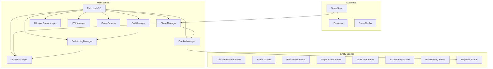
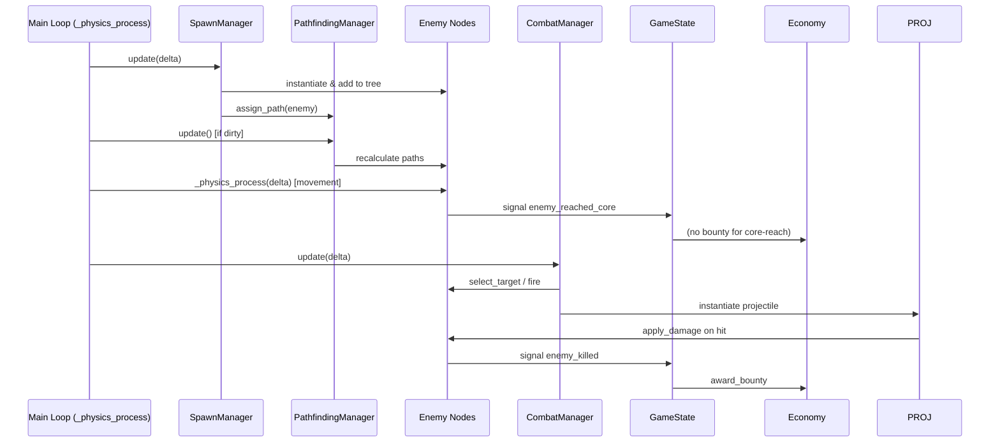
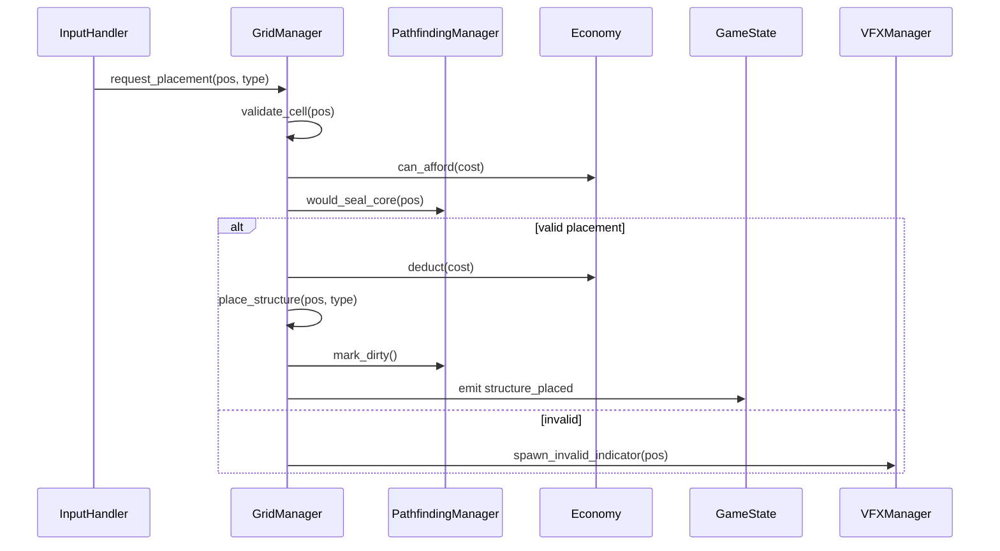

# Design Document: Core Defense — Godot 4.7 Conversion

## Overview

This document describes the full conversion of the "Core Defense" tower defense game from TypeScript/Three.js/Vite to Godot 4.7 with GDScript. The conversion preserves all gameplay mechanics, balance values, and game feel while leveraging Godot's native scene tree, signals, resources, physics, and 3D rendering. The new Godot project will live at `core-defense/godot/` as a self-contained Godot project, keeping the original TypeScript source intact for reference.

The architecture shifts from a custom ECS-inspired pipeline to Godot's node-based scene tree with autoloads for global state, custom Resources for balance data, signals for event decoupling, and `_physics_process` for fixed-timestep logic. The A* pathfinding uses Godot's `AStarGrid2D` where possible, with custom extensions for anti-blocking fallback and sealed-core detection.

## Architecture



## Sequence Diagrams

### Combat Phase Tick



### Structure Placement Flow



## Project Structure

```
core-defense/godot/
├── project.godot
├── scenes/
│   ├── main.tscn                    # Root scene
│   ├── entities/
│   │   ├── critical_resource.tscn
│   │   ├── barrier.tscn
│   │   ├── basic_tower.tscn
│   │   ├── sniper_tower.tscn
│   │   ├── aoe_tower.tscn
│   │   ├── basic_enemy.tscn
│   │   ├── brute_enemy.tscn
│   │   └── projectile.tscn
│   └── ui/
│       ├── hud.tscn
│       ├── shop_panel.tscn
│       ├── context_menu.tscn
│       └── game_over_screen.tscn
├── scripts/
│   ├── autoloads/
│   │   ├── game_config.gd
│   │   ├── game_state.gd
│   │   └── economy.gd
│   ├── managers/
│   │   ├── grid_manager.gd
│   │   ├── pathfinding_manager.gd
│   │   ├── spawn_manager.gd
│   │   ├── combat_manager.gd
│   │   ├── phase_manager.gd
│   │   └── vfx_manager.gd
│   ├── entities/
│   │   ├── base_structure.gd
│   │   ├── barrier.gd
│   │   ├── base_tower.gd
│   │   ├── basic_tower.gd
│   │   ├── sniper_tower.gd
│   │   ├── aoe_tower.gd
│   │   ├── base_enemy.gd
│   │   ├── basic_enemy.gd
│   │   ├── brute_enemy.gd
│   │   ├── critical_resource.gd
│   │   └── projectile.gd
│   ├── ui/
│   │   ├── hud.gd
│   │   ├── shop_panel.gd
│   │   ├── context_menu.gd
│   │   └── game_over_screen.gd
│   └── camera/
│       └── game_camera.gd
└── resources/
    ├── structure_data/
    │   ├── barrier_data.tres
    │   ├── basic_tower_data.tres
    │   ├── sniper_tower_data.tres
    │   └── aoe_tower_data.tres
    └── enemy_data/
        ├── basic_enemy_data.tres
        └── brute_enemy_data.tres
```

## Components and Interfaces

### Component 1: GameConfig (Autoload)

**Purpose**: Centralized balance data accessible globally. Replaces `config.ts`.

```gdscript
# scripts/autoloads/game_config.gd
extends Node

const GRID_WIDTH: int = 20
const GRID_HEIGHT: int = 20
const CELL_SIZE: float = 1.0
const STARTING_GOLD: int = 100
const CAMERA_AZIMUTH: float = 45.0
const CAMERA_ELEVATION: float = 60.0

const STRUCTURES: Dictionary = {
    "barrier": {"cost": 10, "max_health": 150},
    "basic_tower": {"cost": 25, "max_health": 50, "range": 3.0, "damage": 15, "fire_rate": 1.5, "targeting": "closest_to_core"},
    "sniper_tower": {"cost": 50, "max_health": 40, "range": 6.0, "damage": 60, "fire_rate": 0.4, "targeting": "highest_health"},
    "aoe_tower": {"cost": 50, "max_health": 40, "range": 2.5, "damage": 20, "fire_rate": 0.8, "targeting": "closest_to_core", "aoe_radius": 1.0},
}

const ENEMIES: Dictionary = {
    "basic": {"health": 50, "speed": 2.0, "damage": 10, "structure_damage": 0, "bounty": 5},
    "brute": {"health": 200, "speed": 1.0, "damage": 25, "structure_damage": 25, "bounty": 15},
}

const ECONOMY: Dictionary = {
    "sell_multiplier": 0.5,
    "repair_multiplier": 0.7,
    "wave_bonus_base": 20,
    "wave_bonus_increment": 5,
}

const SPAWN: Dictionary = {
    "min_interval": 0.3,
    "max_interval": 2.0,
    "base_enemy_count": 5,
    "enemy_count_increment": 2,
    "brute_start_wave": 4,
}

const CRITICAL_RESOURCE: Dictionary = {
    "max_health": 100,
}
```

**Responsibilities**:
- Provide all balance constants to any system via `GameConfig.STRUCTURES["barrier"]["cost"]`
- Never mutated at runtime

### Component 2: GameState (Autoload)

**Purpose**: Central mutable state authority. Replaces `state.ts`.

```gdscript
# scripts/autoloads/game_state.gd
extends Node

signal phase_changed(old_phase: StringName, new_phase: StringName)
signal gold_changed(new_amount: int)
signal core_damaged(current_health: int, max_health: int)
signal game_over_triggered(wave_reached: int)
signal wave_started(wave_number: int)
signal enemy_killed(enemy_node: Node, bounty: int)
signal enemy_reached_core(damage: int)
signal structure_placed(structure_node: Node)
signal structure_sold(position: Vector2i, refund: int)
signal structure_destroyed(position: Vector2i)
signal wave_complete(wave_number: int)

enum Phase { PREPARATION, COMBAT, GAME_OVER }

var phase: Phase = Phase.PREPARATION
var gold: int = GameConfig.STARTING_GOLD
var wave_number: int = 1
var core_health: int = GameConfig.CRITICAL_RESOURCE["max_health"]
var core_max_health: int = GameConfig.CRITICAL_RESOURCE["max_health"]
var enemies_remaining: int = 0

func set_phase(new_phase: Phase) -> void:
    var old := phase
    phase = new_phase
    phase_changed.emit(Phase.keys()[old], Phase.keys()[new_phase])

func damage_core(amount: int) -> void:
    core_health = max(0, core_health - amount)
    core_damaged.emit(core_health, core_max_health)
    if core_health <= 0:
        set_phase(Phase.GAME_OVER)
        game_over_triggered.emit(wave_number)

func reset() -> void:
    phase = Phase.PREPARATION
    gold = GameConfig.STARTING_GOLD
    wave_number = 1
    core_health = core_max_health
    enemies_remaining = 0
```

**Responsibilities**:
- Single source of truth for phase, gold, wave, core health
- Emit signals on every state mutation for UI/VFX reactivity
- Enforce state machine transitions

### Component 3: Economy (Autoload)

**Purpose**: Gold transaction logic. Replaces `economy.ts`.

```gdscript
# scripts/autoloads/economy.gd
extends Node

func can_afford(cost: int) -> bool:
    return GameState.gold >= cost

func deduct(amount: int) -> bool:
    if amount < 0 or GameState.gold < amount:
        return false
    GameState.gold -= amount
    GameState.gold_changed.emit(GameState.gold)
    return true

func credit(amount: int) -> void:
    if amount <= 0:
        return
    GameState.gold += amount
    GameState.gold_changed.emit(GameState.gold)

func calculate_sell_value(current_health: int, max_health: int, original_cost: int) -> int:
    if max_health <= 0 or original_cost <= 0:
        return 0
    return int(floor(float(current_health) / float(max_health) * float(original_cost) * GameConfig.ECONOMY["sell_multiplier"]))

func calculate_repair_cost(current_health: int, max_health: int, original_cost: int) -> int:
    if max_health <= 0 or original_cost <= 0 or current_health >= max_health:
        return 0
    var damage_fraction := float(max_health - current_health) / float(max_health)
    return int(ceil(damage_fraction * float(original_cost) * GameConfig.ECONOMY["repair_multiplier"]))

func get_wave_bonus(wave_number: int) -> int:
    return GameConfig.ECONOMY["wave_bonus_base"] + (wave_number - 1) * GameConfig.ECONOMY["wave_bonus_increment"]

func get_enemy_bounty(enemy_type: String) -> int:
    return GameConfig.ENEMIES.get(enemy_type, {}).get("bounty", 0)

func award_bounty(enemy_type: String) -> int:
    var bounty := get_enemy_bounty(enemy_type)
    credit(bounty)
    return bounty

func award_wave_bonus(wave_number: int) -> int:
    var bonus := get_wave_bonus(wave_number)
    credit(bonus)
    return bonus
```

**Responsibilities**:
- All gold math (buy, sell, repair, bounty, wave bonus)
- Emits `gold_changed` through GameState on every transaction

### Component 4: GridManager

**Purpose**: Manages the 20x20 grid model, cell occupancy, structure placement/sell/repair. Replaces `grid.ts` and `placement.ts`.

```gdscript
# scripts/managers/grid_manager.gd
extends Node3D

signal placement_succeeded(position: Vector2i, structure_type: String)
signal placement_failed(position: Vector2i, reason: String)

var cells: Array[Array] = []  # 2D array of cell dictionaries
var structure_nodes: Dictionary = {}  # Vector2i -> Node reference

const STRUCTURE_SCENES: Dictionary = {
    "barrier": preload("res://scenes/entities/barrier.tscn"),
    "basic_tower": preload("res://scenes/entities/basic_tower.tscn"),
    "sniper_tower": preload("res://scenes/entities/sniper_tower.tscn"),
    "aoe_tower": preload("res://scenes/entities/aoe_tower.tscn"),
}

func _ready() -> void:
    _initialize_grid()
    _place_critical_resource()

func _initialize_grid() -> void:
    cells.clear()
    for row in range(GameConfig.GRID_HEIGHT):
        var row_arr: Array = []
        for col in range(GameConfig.GRID_WIDTH):
            row_arr.append({"occupant": null, "is_walkable": true, "is_core": false})
        cells.append(row_arr)

func get_cell(pos: Vector2i) -> Dictionary:
    if pos.x < 0 or pos.x >= GameConfig.GRID_WIDTH or pos.y < 0 or pos.y >= GameConfig.GRID_HEIGHT:
        return {}
    return cells[pos.y][pos.x]

func is_walkable(pos: Vector2i) -> bool:
    var cell := get_cell(pos)
    return cell.get("is_walkable", false)

func try_place_structure(pos: Vector2i, structure_type: String) -> bool:
    var cell := get_cell(pos)
    if cell.is_empty():
        placement_failed.emit(pos, "out_of_bounds")
        return false
    if cell["occupant"] != null or cell["is_core"]:
        placement_failed.emit(pos, "cell_occupied")
        return false
    var cost: int = GameConfig.STRUCTURES[structure_type]["cost"]
    if not Economy.can_afford(cost):
        placement_failed.emit(pos, "insufficient_gold")
        return false
    # Anti-blocking check delegated to PathfindingManager
    if _would_seal_core(pos):
        placement_failed.emit(pos, "would_seal_core")
        return false
    # Execute placement
    Economy.deduct(cost)
    _place_at(pos, structure_type)
    placement_succeeded.emit(pos, structure_type)
    return true
```

**Responsibilities**:
- Grid initialization with 2x2 core at center
- Cell occupancy tracking (occupant reference, walkability, core flag)
- Structure placement validation (bounds, occupancy, gold, seal check)
- Sell/repair operations
- Emitting signals for UI/pathfinding reactivity

### Component 5: PathfindingManager

**Purpose**: A* pathfinding with dirty-flag recalculation, sealed-core detection, and anti-blocking fallback. Replaces `pathfinding.ts`.

```gdscript
# scripts/managers/pathfinding_manager.gd
extends Node

var astar: AStarGrid2D
var _dirty: bool = false
var _core_cells: Array[Vector2i] = []
var _core_adjacent_cells: Array[Vector2i] = []

func _ready() -> void:
    astar = AStarGrid2D.new()
    astar.region = Rect2i(0, 0, GameConfig.GRID_WIDTH, GameConfig.GRID_HEIGHT)
    astar.diagonal_mode = AStarGrid2D.DIAGONAL_MODE_NEVER
    astar.update()
    _compute_core_cells()

func mark_dirty() -> void:
    _dirty = true

func update_if_dirty() -> void:
    if _dirty:
        _sync_walkability()
        _recalculate_all_enemy_paths()
        _dirty = false

func find_path_to_core(from: Vector2i) -> PackedVector2Array:
    var best_path: PackedVector2Array = PackedVector2Array()
    var best_cost: float = INF
    for target in _core_adjacent_cells:
        if not astar.is_point_solid(target):
            var path := astar.get_point_path(from, target)
            if path.size() > 0 and path.size() < best_cost:
                best_path = path
                best_cost = path.size()
    return best_path

func is_core_sealed() -> bool:
    # BFS from core-adjacent walkable cells to any grid edge
    var visited: Dictionary = {}
    var queue: Array[Vector2i] = []
    for cell in _core_adjacent_cells:
        if not astar.is_point_solid(cell):
            queue.append(cell)
            visited[cell] = true
    while queue.size() > 0:
        var current := queue.pop_front() as Vector2i
        if _is_edge_cell(current):
            return false
        for neighbor in _get_walkable_neighbors(current):
            if not visited.has(neighbor):
                visited[neighbor] = true
                queue.append(neighbor)
    return true

func would_seal_core_if_blocked(pos: Vector2i) -> bool:
    # Temporarily block the cell and test
    astar.set_point_solid(pos, true)
    var sealed := is_core_sealed()
    astar.set_point_solid(pos, false)
    return sealed
```

**Responsibilities**:
- Wraps `AStarGrid2D` for 4-directional pathfinding
- Dirty-flag batch recalculation (once per physics frame max)
- Core-adjacent target selection (path to nearest adjacent walkable cell)
- Sealed-core detection via BFS flood fill
- Anti-blocking fallback: path to nearest barrier when sealed
- Provides `would_seal_core_if_blocked` for placement validation

### Component 6: SpawnManager

**Purpose**: Wave composition, staggered spawning, edge selection. Replaces `spawning.ts`.

```gdscript
# scripts/managers/spawn_manager.gd
extends Node

var _spawn_queue: Array[String] = []
var _spawn_edges: Array[String] = []
var _spawn_index: int = 0
var _spawn_timer: float = 0.0
var _spawn_interval: float = 2.0
var _active: bool = false

const ENEMY_SCENES: Dictionary = {
    "basic": preload("res://scenes/entities/basic_enemy.tscn"),
    "brute": preload("res://scenes/entities/brute_enemy.tscn"),
}

func begin_wave(wave_number: int) -> void:
    var composition := _get_wave_composition(wave_number)
    _spawn_queue = _build_spawn_queue(composition)
    _spawn_edges = _select_spawn_edges()
    _spawn_index = 0
    _spawn_timer = 0.0
    _spawn_interval = composition["interval"]
    _active = true
    GameState.enemies_remaining = composition["total"]

func update(delta: float) -> void:
    if not _active:
        return
    _spawn_timer += delta
    while _spawn_timer >= _spawn_interval and _spawn_index < _spawn_queue.size():
        _spawn_timer -= _spawn_interval
        _spawn_enemy()
    if _spawn_index >= _spawn_queue.size():
        _active = false

func _get_wave_composition(wave_number: int) -> Dictionary:
    var total := 5 + (wave_number - 1) * 2
    var brute_count := max(0, wave_number - 3)
    var basic_count := total - brute_count
    var interval := clampf(2.0 - wave_number * 0.1, GameConfig.SPAWN["min_interval"], GameConfig.SPAWN["max_interval"])
    return {"basic": basic_count, "brute": brute_count, "total": total, "interval": interval}

func _select_spawn_edges() -> Array[String]:
    var all_edges: Array[String] = ["top", "bottom", "left", "right"]
    all_edges.shuffle()
    return all_edges.slice(0, randi_range(2, 4))

func _get_spawn_position(edge: String) -> Vector2i:
    match edge:
        "top": return Vector2i(randi_range(0, GameConfig.GRID_WIDTH - 1), 0)
        "bottom": return Vector2i(randi_range(0, GameConfig.GRID_WIDTH - 1), GameConfig.GRID_HEIGHT - 1)
        "left": return Vector2i(0, randi_range(0, GameConfig.GRID_HEIGHT - 1))
        "right": return Vector2i(GameConfig.GRID_WIDTH - 1, randi_range(0, GameConfig.GRID_HEIGHT - 1))
    return Vector2i.ZERO
```

**Responsibilities**:
- Calculate wave composition (total = 5 + (N-1)*2, brutes = max(0, N-3))
- Build staggered spawn queue with brutes distributed evenly
- Select 2-4 random edges per wave
- Spawn enemies at intervals, assigning paths via PathfindingManager
- Handle spawn position fallback when pathfinding fails from initial position

### Component 7: CombatManager

**Purpose**: Tower targeting, projectile creation, damage resolution. Replaces `combat.ts`.

```gdscript
# scripts/managers/combat_manager.gd
extends Node

@onready var _enemies_group: Node = get_tree().get_first_node_in_group("enemies_container")
@onready var _projectiles_group: Node = get_tree().get_first_node_in_group("projectiles_container")

const PROJECTILE_SCENE := preload("res://scenes/entities/projectile.tscn")
const PROJECTILE_SPEED: float = 10.0

func update(delta: float) -> void:
    if GameState.phase != GameState.Phase.COMBAT:
        return
    _update_towers(delta)
    _update_projectiles(delta)

func _update_towers(delta: float) -> void:
    for tower in get_tree().get_nodes_in_group("towers"):
        tower.update_combat(delta, _get_enemies_in_range(tower))

func _update_projectiles(delta: float) -> void:
    for proj in get_tree().get_nodes_in_group("projectiles"):
        proj.update_movement(delta)

func _get_enemies_in_range(tower: Node3D) -> Array:
    var in_range: Array = []
    for enemy in get_tree().get_nodes_in_group("enemies"):
        var dist := tower.grid_position.distance_to(Vector2(enemy.grid_position))
        if dist <= tower.attack_range:
            in_range.append(enemy)
    return in_range
```

**Responsibilities**:
- Per-frame tower cooldown management and target selection
- Projectile instantiation and tracking movement
- Damage application (single-target and AOE)
- Enemy destruction detection and bounty awarding

### Component 8: PhaseManager

**Purpose**: Manages phase state machine transitions. Replaces `phase-manager.ts`.

```gdscript
# scripts/managers/phase_manager.gd
extends Node

const VALID_TRANSITIONS: Dictionary = {
    GameState.Phase.PREPARATION: [GameState.Phase.COMBAT],
    GameState.Phase.COMBAT: [GameState.Phase.PREPARATION, GameState.Phase.GAME_OVER],
    GameState.Phase.GAME_OVER: [GameState.Phase.PREPARATION],
}

func start_wave() -> bool:
    if GameState.phase != GameState.Phase.PREPARATION:
        return false
    GameState.set_phase(GameState.Phase.COMBAT)
    GameState.wave_started.emit(GameState.wave_number)
    return true

func complete_wave() -> void:
    Economy.award_wave_bonus(GameState.wave_number)
    GameState.wave_number += 1
    GameState.set_phase(GameState.Phase.PREPARATION)
    GameState.wave_complete.emit(GameState.wave_number - 1)

func trigger_game_over() -> void:
    GameState.set_phase(GameState.Phase.GAME_OVER)

func restart_game() -> void:
    GameState.reset()
    # Clear all entities from scene tree
    get_tree().call_group("enemies", "queue_free")
    get_tree().call_group("projectiles", "queue_free")
    get_tree().call_group("structures", "queue_free")
```

**Responsibilities**:
- Validate phase transitions against allowed transitions
- Trigger wave start (delegates to SpawnManager)
- Handle wave completion (bonus, wave increment, phase switch)
- Game over and restart orchestration

### Component 9: Entity Scripts (Scene-Based)

**Purpose**: Each entity type is a Godot scene with attached script. Replaces `entities.ts` + entity store.

#### Base Enemy

```gdscript
# scripts/entities/base_enemy.gd
class_name BaseEnemy
extends CharacterBody3D

signal died(enemy: BaseEnemy)
signal reached_core(enemy: BaseEnemy, damage: int)

@export var enemy_type: String = "basic"
@export var max_health: int = 50
@export var move_speed: float = 2.0
@export var core_damage: int = 10
@export var structure_damage: int = 0
@export var bounty: int = 5

var current_health: int
var grid_position: Vector2i
var path: PackedVector2Array = PackedVector2Array()
var path_index: int = 0
var interpolation: float = 0.0
var is_attacking_barrier: bool = false
var attack_cooldown: float = 0.0

func _ready() -> void:
    current_health = max_health
    add_to_group("enemies")

func _physics_process(delta: float) -> void:
    if is_attacking_barrier:
        _update_barrier_attack(delta)
        return
    if path.is_empty() or path_index >= path.size() - 1:
        return
    _move_along_path(delta)

func take_damage(amount: int) -> void:
    current_health -= amount
    if current_health <= 0:
        current_health = 0
        died.emit(self)
        queue_free()

func set_path(new_path: PackedVector2Array) -> void:
    path = new_path
    path_index = 0
    interpolation = 0.0

func _move_along_path(delta: float) -> void:
    interpolation += move_speed * delta
    while interpolation >= 1.0 and path_index < path.size() - 1:
        interpolation -= 1.0
        path_index += 1
        grid_position = Vector2i(path[path_index])
        if path_index >= path.size() - 1:
            reached_core.emit(self, core_damage)
            queue_free()
            return
    # Interpolate world position
    if path_index < path.size() - 1:
        var current_wp := Vector3(path[path_index].x + 0.5, 0, path[path_index].y + 0.5)
        var next_wp := Vector3(path[path_index + 1].x + 0.5, 0, path[path_index + 1].y + 0.5)
        global_position = current_wp.lerp(next_wp, min(interpolation, 1.0))
        global_position.y = 0.25
```

#### Base Tower

```gdscript
# scripts/entities/base_tower.gd
class_name BaseTower
extends Node3D

@export var tower_type: String = "basic_tower"
@export var attack_range: float = 3.0
@export var damage: int = 15
@export var fire_rate: float = 1.5
@export var targeting_priority: String = "closest_to_core"
@export var aoe_radius: float = 0.0
@export var max_health: int = 50
@export var original_cost: int = 25

var current_health: int
var grid_position: Vector2i
var fire_cooldown: float = 0.0
var current_target: BaseEnemy = null

func _ready() -> void:
    current_health = max_health
    add_to_group("towers")
    add_to_group("structures")

func update_combat(delta: float, enemies_in_range: Array) -> void:
    fire_cooldown = max(0.0, fire_cooldown - delta)
    if fire_cooldown > 0.0:
        return
    _validate_target(enemies_in_range)
    if current_target == null:
        current_target = _select_target(enemies_in_range)
    if current_target == null:
        return
    _fire_at(current_target)
    fire_cooldown = 1.0 / fire_rate

func _select_target(enemies: Array) -> BaseEnemy:
    if enemies.is_empty():
        return null
    match targeting_priority:
        "closest_to_core":
            return _get_closest_to_core(enemies)
        "highest_health":
            return _get_highest_health(enemies)
    return enemies[0]
```

**Responsibilities**:
- Self-contained behavior per entity type
- Managed by scene tree (add/remove via `add_child`/`queue_free`)
- Groups for batch queries ("enemies", "towers", "structures", "projectiles")
- Signals for death/core-reach events

### Component 10: GameCamera

**Purpose**: Orthographic camera at 45° azimuth / 60° elevation. Replaces Three.js camera setup.

```gdscript
# scripts/camera/game_camera.gd
extends Camera3D

func _ready() -> void:
    projection = Camera3D.PROJECTION_ORTHOGRAPHIC
    var grid_w := GameConfig.GRID_WIDTH
    var grid_h := GameConfig.GRID_HEIGHT
    size = max(grid_w, grid_h) * 1.2

    var azimuth := deg_to_rad(GameConfig.CAMERA_AZIMUTH)
    var elevation := deg_to_rad(GameConfig.CAMERA_ELEVATION)
    var cam_distance := 30.0

    var center := Vector3(grid_w / 2.0, 0, grid_h / 2.0)
    position = Vector3(
        cos(elevation) * sin(azimuth) * cam_distance + center.x,
        sin(elevation) * cam_distance,
        cos(elevation) * cos(azimuth) * cam_distance + center.z
    )
    look_at(center)
```

### Component 11: Input Handling

**Purpose**: Mouse/touch to grid coordinate mapping via raycasting. Replaces `input-system.ts`.

```gdscript
# Integrated into main scene or dedicated InputHandler node
func _unhandled_input(event: InputEvent) -> void:
    if event is InputEventMouseButton and event.pressed and event.button_index == MOUSE_BUTTON_LEFT:
        var grid_pos := _screen_to_grid(event.position)
        if grid_pos != Vector2i(-1, -1):
            _handle_cell_click(grid_pos)
    elif event is InputEventMouseMotion:
        var grid_pos := _screen_to_grid(event.position)
        _handle_cell_hover(grid_pos)

func _screen_to_grid(screen_pos: Vector2) -> Vector2i:
    var camera := get_viewport().get_camera_3d()
    var from := camera.project_ray_origin(screen_pos)
    var dir := camera.project_ray_normal(screen_pos)
    # Intersect with Y=0 plane
    if dir.y == 0:
        return Vector2i(-1, -1)
    var t := -from.y / dir.y
    if t < 0:
        return Vector2i(-1, -1)
    var hit := from + dir * t
    var col := int(floor(hit.x))
    var row := int(floor(hit.z))
    if row >= 0 and row < GameConfig.GRID_HEIGHT and col >= 0 and col < GameConfig.GRID_WIDTH:
        return Vector2i(col, row)
    return Vector2i(-1, -1)
```

**Responsibilities**:
- Raycast from screen position through orthographic camera to Y=0 ground plane
- Convert hit point to grid coordinates
- Emit cell_click and cell_hover for placement/context menu logic

### Component 12: UI Layer

**Purpose**: HUD, shop panel, context menus, game over screen via Godot Control nodes. Replaces `ui-system.ts`.

```gdscript
# scripts/ui/hud.gd
extends Control

@onready var gold_label: Label = $GoldLabel
@onready var wave_label: Label = $WaveLabel
@onready var enemies_label: Label = $EnemiesLabel
@onready var core_health_bar: ProgressBar = $CoreHealthBar

func _ready() -> void:
    GameState.gold_changed.connect(_on_gold_changed)
    GameState.core_damaged.connect(_on_core_damaged)

func _on_gold_changed(new_amount: int) -> void:
    gold_label.text = "Gold: %d" % new_amount

func _on_core_damaged(current: int, max_hp: int) -> void:
    core_health_bar.value = float(current) / float(max_hp) * 100.0
```

**Responsibilities**:
- Reactive UI updates via signal connections to GameState
- Shop panel with structure buttons (unlock progression: wave 1 barrier+basic, wave 2 sniper, wave 3 AOE)
- Context menu on structure click (sell/repair options)
- Game over overlay with restart button
- Start Wave button visible only during preparation

### Component 13: VFXManager

**Purpose**: Floating damage text, destruction particles, invalid placement indicators. Replaces `vfx.ts`.

```gdscript
# scripts/managers/vfx_manager.gd
extends Node3D

const FLOATING_TEXT_SCENE := preload("res://scenes/ui/floating_text.tscn")

func spawn_floating_text(world_pos: Vector3, text: String, color: Color) -> void:
    var ft := FLOATING_TEXT_SCENE.instantiate()
    ft.global_position = world_pos + Vector3(0, 1.5, 0)
    ft.set_text(text)
    ft.set_color(color)
    add_child(ft)
    # Self-destructs after animation via AnimationPlayer or Tween

func spawn_destruction_effect(world_pos: Vector3) -> void:
    # GPUParticles3D burst of 8-12 orange cubes
    var particles := GPUParticles3D.new()
    particles.global_position = world_pos
    particles.emitting = true
    particles.one_shot = true
    particles.amount = 10
    particles.lifetime = 0.5
    add_child(particles)
    # Auto-free after lifetime
    get_tree().create_timer(0.6).timeout.connect(particles.queue_free)

func spawn_invalid_placement(grid_pos: Vector2i) -> void:
    # Red flash quad at grid position, fades over 1 second
    var mesh := MeshInstance3D.new()
    mesh.mesh = PlaneMesh.new()
    mesh.mesh.size = Vector2(1, 1)
    mesh.global_position = Vector3(grid_pos.x + 0.5, 0.02, grid_pos.y + 0.5)
    var mat := StandardMaterial3D.new()
    mat.albedo_color = Color(1, 0, 0, 0.5)
    mat.transparency = BaseMaterial3D.TRANSPARENCY_ALPHA
    mesh.material_override = mat
    add_child(mesh)
    var tween := create_tween()
    tween.tween_property(mat, "albedo_color:a", 0.0, 1.0)
    tween.tween_callback(mesh.queue_free)
```

**Responsibilities**:
- Floating text (bounty "+5g", damage numbers) using Label3D or billboarded Control
- Destruction particles using GPUParticles3D one-shot bursts
- Invalid placement red flash indicators

## Data Models

### StructureData Resource

```gdscript
# resources/structure_data.gd (custom Resource script)
class_name StructureData
extends Resource

@export var structure_type: String
@export var cost: int
@export var max_health: int
@export var attack_range: float = 0.0
@export var damage: int = 0
@export var fire_rate: float = 0.0
@export var targeting_priority: String = "closest_to_core"
@export var aoe_radius: float = 0.0
```

**Validation Rules**:
- `cost > 0`
- `max_health > 0`
- `attack_range >= 0` (0 for barriers)
- `fire_rate >= 0` (0 for barriers)
- `aoe_radius >= 0` (only > 0 for AOE tower)

### EnemyData Resource

```gdscript
# resources/enemy_data.gd (custom Resource script)
class_name EnemyData
extends Resource

@export var enemy_type: String
@export var health: int
@export var speed: float
@export var damage: int
@export var structure_damage: int
@export var bounty: int
```

**Validation Rules**:
- `health > 0`
- `speed > 0`
- `damage > 0`
- `bounty >= 0`

### Grid Cell (Internal Dictionary)

```gdscript
# Cell structure used in GridManager.cells[row][col]
{
    "occupant": null,        # Node reference or null
    "is_walkable": true,     # bool
    "is_core": false,        # bool
}
```

## Error Handling

### Error Scenario 1: Placement on Occupied Cell

**Condition**: Player clicks a cell that already has a structure or is a core cell
**Response**: GridManager emits `placement_failed` signal with reason "cell_occupied"; VFXManager shows red flash
**Recovery**: Player can click another cell; no gold deducted

### Error Scenario 2: Insufficient Gold

**Condition**: Player attempts to place structure with insufficient gold
**Response**: GridManager emits `placement_failed` with reason "insufficient_gold"; shop button appears grayed out
**Recovery**: Player earns more gold via bounties/wave bonuses

### Error Scenario 3: Would Seal Core

**Condition**: Placing a structure would completely block all paths to the core
**Response**: GridManager emits `placement_failed` with reason "would_seal_core"; red flash indicator
**Recovery**: Player must place elsewhere; at least one path to core must always exist

### Error Scenario 4: Spawn Position Pathfinding Failure

**Condition**: A selected spawn position has no valid path to core (edge cell blocked)
**Response**: SpawnManager tries alternative positions on other edges (up to 5 attempts per edge)
**Recovery**: If all fail, enemy spawns without a path and remains stationary (edge case)

### Error Scenario 5: Core Destroyed

**Condition**: Core health reaches 0
**Response**: GameState transitions to GAME_OVER phase; all systems freeze; game over overlay shown
**Recovery**: Player clicks "Restart" to reset entire game state and scene tree

## Testing Strategy

### Unit Testing Approach

Use GdUnit4 (GDScript unit testing framework) for isolated logic testing:
- Economy calculations (sell value, repair cost, wave bonus, bounty)
- Wave composition calculation
- Grid cell validation logic
- Pathfinding sealed-core detection
- Phase transition validation

### Property-Based Testing Approach

**Property Test Library**: GdUnit4 with custom generators (GDScript does not have a native PBT library, so properties will be tested using parameterized tests with random inputs generated via GDScript's `randf()`/`randi()` in loops of 100+ iterations)

Key properties:
- Economy round-trip (sell then rebuy preserves game state invariants)
- Pathfinding: if core is not sealed, at least one edge cell can reach core
- Wave composition: total always equals basic + brute counts
- Placement validation: occupied cells always reject placement

### Integration Testing Approach

Scene-based integration tests using Godot's test runner:
- Full wave cycle: preparation → combat → wave complete → preparation
- Structure placement and pathfinding recalculation
- Enemy reaches core → game over flow
- Restart resets all state

## Performance Considerations

- Pathfinding recalculation is batched (dirty flag, max once per physics frame)
- Enemy group queries use Godot's `get_nodes_in_group()` which is O(n) — acceptable for <50 enemies per wave
- GPUParticles3D for destruction effects (GPU-accelerated, no CPU overhead)
- Orthographic camera eliminates depth-sorting complexity
- Tower range checks use squared distance to avoid sqrt where possible

## Security Considerations

Not applicable — single-player offline game with no network communication.

## Dependencies

- **Godot 4.7** (stable) — game engine
- **GdUnit4** — unit testing framework (optional, for development)
- No external plugins required — all functionality uses Godot built-in nodes

## Key Conversion Mapping

| TypeScript Concept | Godot Equivalent |
|---|---|
| Entity Store (Map-based) | Scene tree + groups |
| Entity interfaces | Scene scripts (class_name) |
| GameConfig constants | Autoload singleton |
| GameState + events | Autoload with signals |
| System pipeline tick order | `_physics_process` call order in scene tree |
| Three.js scene/meshes | Node3D + MeshInstance3D |
| Raycasting (Three.js) | Camera3D.project_ray_origin/normal |
| CSS2DRenderer (floating text) | Label3D or Control + Viewport |
| HTML/CSS UI overlay | CanvasLayer + Control nodes |
| requestAnimationFrame loop | Godot's built-in game loop |
| Fixed timestep (manual accumulator) | `_physics_process(delta)` at 60 Hz (project setting) |
| A* with binary heap | AStarGrid2D (built-in) |
| crypto.randomUUID() | Not needed — node references replace entity IDs |
| Event callbacks | Godot signals |

## Godot Project Settings

Key project settings to configure:
- `physics/common/physics_ticks_per_second = 60` (matches original fixed timestep)
- `rendering/renderer/rendering_method = "forward_plus"` (3D rendering)
- `display/window/size/viewport_width = 1280`
- `display/window/size/viewport_height = 720`
- `display/window/stretch/mode = "canvas_items"`


## Correctness Properties

*A property is a characteristic or behavior that should hold true across all valid executions of a system—essentially, a formal statement about what the system should do. Properties serve as the bridge between human-readable specifications and machine-verifiable correctness guarantees.*

### Property 1: Grid-to-World Coordinate Conversion

*For any* valid grid position (col, row) where 0 ≤ col < 20 and 0 ≤ row < 20, converting to world position SHALL produce (col + 0.5, 0, row + 0.5).

**Validates: Requirement 1.4**

### Property 2: Placement Rejection on Occupied Cells

*For any* grid cell that has a non-null occupant or is marked as a core cell, attempting to place any structure type SHALL fail with reason "cell_occupied" regardless of available gold.

**Validates: Requirements 2.2**

### Property 3: Placement Success on Valid Cells

*For any* empty walkable non-core cell during Preparation phase where the player has sufficient gold and placing would not seal the core, placement SHALL succeed, deducting exactly the structure cost from gold.

**Validates: Requirements 2.1, 2.5**

### Property 4: Placement-Sell Round Trip (Cell State)

*For any* structure placed on a cell, after selling that structure, the cell SHALL return to walkable and unoccupied state identical to its pre-placement state.

**Validates: Requirements 2.6, 3.3**

### Property 5: Sell Value Formula

*For any* structure with currentHealth > 0, maxHealth > 0, and originalCost > 0, the sell value SHALL equal floor((currentHealth / maxHealth) × originalCost × 0.5).

**Validates: Requirement 3.2**

### Property 6: Repair Cost Formula

*For any* damaged structure with currentHealth < maxHealth, maxHealth > 0, and originalCost > 0, the repair cost SHALL equal ceil(((maxHealth - currentHealth) / maxHealth) × originalCost × 0.7).

**Validates: Requirement 3.5**

### Property 7: Gold Non-Negativity Invariant

*For any* sequence of economy operations (deductions, credits, bounties, wave bonuses), player gold SHALL never become negative.

**Validates: Requirement 4.4**

### Property 8: Wave Bonus Formula

*For any* wave number N ≥ 1, the wave completion bonus SHALL equal 20 + (N - 1) × 5.

**Validates: Requirement 4.3**

### Property 9: Pathfinding Endpoint Validity

*For any* starting position that has a valid path to the core, the path's final waypoint SHALL be a walkable cell directly adjacent to one of the 4 core cells.

**Validates: Requirement 5.3**

### Property 10: Sealed Core Detection Correctness

*For any* grid state where no walkable cell adjacent to the core can reach a grid edge via walkable cells, the sealed-core detection SHALL return true; for any grid state where at least one core-adjacent walkable cell can reach an edge, it SHALL return false.

**Validates: Requirement 5.4**

### Property 11: Would-Seal-Core Prediction

*For any* walkable cell, the would_seal_core_if_blocked function SHALL return true if and only if blocking that single cell would cause the sealed-core condition to become true.

**Validates: Requirement 5.6**

### Property 12: Enemy Movement Progress

*For any* enemy with an assigned path of length L, after t seconds of uninterrupted movement at speed s, the enemy's path_index SHALL be approximately min(floor(s × t), L - 1), and its interpolated world position SHALL lie between consecutive waypoint world positions.

**Validates: Requirements 6.1, 6.2**

### Property 13: Enemy Core Arrival

*For any* enemy that advances to the final waypoint of its path, it SHALL emit reached_core with damage equal to its configured core_damage value.

**Validates: Requirement 6.3**

### Property 14: Wave Composition Formula

*For any* wave number N ≥ 1, the wave composition SHALL produce total = 5 + (N-1) × 2, brutes = max(0, N - 3), and basics = total - brutes, where basic + brute always equals total.

**Validates: Requirement 7.1**

### Property 15: Spawn Interval Formula

*For any* wave number N ≥ 1, the spawn interval SHALL equal clamp(2.0 - N × 0.1, 0.3, 2.0).

**Validates: Requirement 7.2**

### Property 16: Spawn Edge Selection Bounds

*For any* wave, the number of selected spawn edges SHALL be between 2 and 4 inclusive.

**Validates: Requirement 7.3**

### Property 17: Tower Targeting Priority

*For any* tower with enemies in range, the selected target SHALL be: (a) for "closest_to_core" priority, the enemy with lowest remaining path cost; (b) for "highest_health" priority, the enemy with highest current health.

**Validates: Requirements 8.2, 8.3, 8.4**

### Property 18: AOE Damage Radius

*For any* AOE projectile impact at position P, all enemies within 1.0 cell Euclidean distance of P SHALL receive damage, and all enemies outside that radius SHALL receive no damage from that projectile.

**Validates: Requirement 8.7**

### Property 19: Phase Transition Validity

*For any* (current_phase, target_phase) pair, the transition SHALL succeed only for: (Preparation→Combat), (Combat→Preparation), (Combat→Game_Over), (Game_Over→Preparation); all other transitions SHALL fail.

**Validates: Requirement 9.1**

### Property 20: Game Over Freezes Systems

*For any* game state in Game_Over phase, calling update on CombatManager or SpawnManager SHALL produce no side effects (no new projectiles, no new enemies, no damage applied).

**Validates: Requirement 9.6**

### Property 21: Shop Unlock Progression

*For any* wave number N, the unlocked structures SHALL be: N ≥ 1 → Barrier + Basic Tower; N ≥ 2 → additionally Sniper Tower; N ≥ 3 → additionally AOE Tower.

**Validates: Requirement 12.5**

### Property 22: Sell/Repair Phase Restriction

*For any* sell or repair attempt during Combat or Game_Over phase, the operation SHALL be rejected regardless of the structure's state or available gold.

**Validates: Requirement 3.7**

