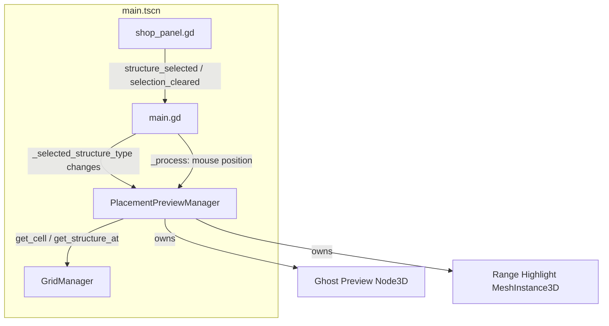

# Design Document: Range and Placement Visibility

## Overview

This feature adds two interconnected visual feedback systems to the Preparation phase: a ghost preview that shows a translucent structure at the hovered cell, and a range highlight overlay that displays which cells fall within a tower's attack range. Both systems activate only during Preparation phase and respond to mouse movement, shop selection state, and placed structure hover.

The design introduces a new `PlacementPreviewManager` that owns both the ghost preview node and the range highlight mesh. It listens to existing signals (`structure_selected`, `selection_cleared`, `phase_changed`) and polls mouse position each frame to drive state transitions. The range calculation is a pure function exposed for testability.

## Architecture



### Integration Point

`PlacementPreviewManager` is added as a child node of the main scene (sibling to GridManager, VFXManager, etc.). `main.gd` forwards relevant state changes and mouse position to it. This keeps the existing input handling in `main.gd` intact while delegating all preview/range rendering to the new manager.

### Design Rationale

- **Separate manager instead of inline in main.gd**: The preview logic involves per-frame mesh updates, ghost instance management, and range computation. Keeping it in its own manager follows the existing pattern (VFXManager, CombatManager) and avoids bloating main.gd.
- **ImmediateMesh for range highlight**: The grid overlay already uses ImmediateMesh for line drawing. Range highlights use a similar approach with filled quads (PlaneMesh per cell would be wasteful; a single ImmediateMesh with quad faces is more efficient for dynamic cell sets that change every frame).
- **Ghost preview via scene instantiation**: Reusing the actual structure scene (with a transparent material override) ensures visual consistency and adapts automatically if structure models change.

## Components and Interfaces

### PlacementPreviewManager (`scripts/managers/placement_preview_manager.gd`)

```gdscript
## PlacementPreviewManager
## Manages ghost structure preview and range cell highlighting during Preparation phase.
extends Node3D

# --- State ---
var _active_type: String = ""           # Current shop selection (or "" if none)
var _hovered_cell: Vector2i = Vector2i(-1, -1)  # Currently hovered grid cell
var _ghost_instance: Node3D = null      # The ghost preview node
var _range_mesh: MeshInstance3D = null   # Range highlight mesh instance
var _last_highlighted_cells: Array[Vector2i] = []

# --- References ---
@export var grid_manager_path: NodePath = NodePath("")
var _grid_manager: Node3D = null

# --- Public API ---

## Called by main.gd when shop selection changes.
func set_active_type(structure_type: String) -> void

## Called by main.gd when selection is cleared.
func clear_active_type() -> void

## Called by main.gd every _process frame with current hovered cell.
func update_hover(cell: Vector2i) -> void

## Called when phase changes (hides everything if not Preparation).
func on_phase_changed(old_phase: StringName, new_phase: StringName) -> void

# --- Pure Computation (static) ---

## Computes which cells are within range of a source cell.
## Returns Array[Vector2i] of in-bounds cells within Euclidean distance.
static func compute_cells_in_range(source: Vector2i, attack_range: float) -> Array[Vector2i]
```

### Ghost Preview Behavior

| State | Ghost Visible | Range Visible |
|-------|--------------|---------------|
| No selection, not hovering structure | No | No |
| No selection, hovering tower | No | Yes |
| No selection, hovering barrier | No | No |
| Selection active, hovering valid cell | Yes | Yes (if tower) |
| Selection active, hovering occupied/off-grid | No | No |
| Combat or Game Over phase | No | No |

### Range Highlight Rendering

The range overlay is a single `MeshInstance3D` with an `ImmediateMesh`. Each frame the hovered cell or state changes, the mesh is rebuilt:

1. Clear the ImmediateMesh surface
2. For each cell in the highlighted set, add a quad (two triangles) at `y = 0.015` (above grid lines at 0.01)
3. Apply an unshaded, alpha-blended material (e.g., `Color(0.2, 0.6, 1.0, 0.35)` — a soft blue)

This approach avoids creating/destroying individual mesh instances per cell and keeps draw calls minimal.

### Ghost Preview Rendering

When a new structure type is selected:
1. Free any existing ghost instance
2. Instantiate the structure's scene from `GridManager.STRUCTURE_SCENES`
3. Apply a transparent material override recursively to all `MeshInstance3D` children (albedo alpha ~0.5, transparency enabled, unshaded)
4. Disable any scripts/signals on the ghost (it's visual only)
5. Add as child of PlacementPreviewManager

When hovering a valid cell:
- Set `ghost_instance.position = grid_to_world(cell)`
- Set `ghost_instance.visible = true`

When conditions not met:
- Set `ghost_instance.visible = false`

## Data Models

### Range Computation Input/Output

```gdscript
# Input
var source: Vector2i      # Grid cell (col, row)
var attack_range: float   # From GameConfig.STRUCTURES[type]["range"]

# Output
var cells_in_range: Array[Vector2i]  # All cells within Euclidean distance
```

### Computation Algorithm

```gdscript
static func compute_cells_in_range(source: Vector2i, attack_range: float) -> Array[Vector2i]:
    var result: Array[Vector2i] = []
    var range_int: int = int(ceil(attack_range))

    for dy in range(-range_int, range_int + 1):
        for dx in range(-range_int, range_int + 1):
            var candidate := Vector2i(source.x + dx, source.y + dy)
            # Bounds check
            if candidate.x < 0 or candidate.x >= GameConfig.GRID_WIDTH:
                continue
            if candidate.y < 0 or candidate.y >= GameConfig.GRID_HEIGHT:
                continue
            # Euclidean distance (cell centers)
            var dist := sqrt(float(dx * dx + dy * dy))
            if dist <= attack_range:
                result.append(candidate)

    return result
```

### Structure Range Lookup — Single Source of Truth

The range highlight MUST always reflect the exact same range that the combat system uses for targeting. There are two lookup paths depending on context:

1. **Shop selection preview** (structure not yet placed): Read from `GameConfig.STRUCTURES[type]["range"]`. This is the same source that tower `_ready()` methods use to initialize `attack_range`.
2. **Placed structure hover**: Read the instance's `attack_range` property directly (e.g., `tower.attack_range`). This ensures accuracy even if a future upgrade system modifies a tower's range at runtime.

The `CombatManager._get_enemies_in_range()` function uses `tower.attack_range` for its distance check, so reading the same property for placed towers guarantees visual-to-mechanical parity.

```gdscript
## Returns the attack range for a structure type from GameConfig, or -1.0 if none defined.
## Used for shop selection preview (structure not yet instantiated).
static func get_structure_range_from_config(structure_type: String) -> float:
    var config: Dictionary = GameConfig.STRUCTURES.get(structure_type, {})
    return config.get("range", -1.0)

## Returns the attack range for a placed structure instance.
## Reads the live instance property to stay in sync with combat targeting.
static func get_placed_structure_range(structure: Node3D) -> float:
    if structure is BaseTower:
        return structure.attack_range
    return -1.0
```

### Ghost Material Configuration

```gdscript
const GHOST_OPACITY: float = 0.5
const GHOST_COLOR_VALID := Color(1.0, 1.0, 1.0, GHOST_OPACITY)

func _apply_ghost_material(node: Node3D) -> void:
    for child in node.get_children():
        if child is MeshInstance3D:
            var mat := StandardMaterial3D.new()
            mat.albedo_color = GHOST_COLOR_VALID
            mat.transparency = BaseMaterial3D.TRANSPARENCY_ALPHA
            mat.shading_mode = BaseMaterial3D.SHADING_MODE_UNSHADED
            child.material_override = mat
        if child is Node3D:
            _apply_ghost_material(child)
```

### Range Highlight Material

```gdscript
const RANGE_COLOR := Color(0.2, 0.6, 1.0, 0.35)

var _range_material: StandardMaterial3D

func _create_range_material() -> StandardMaterial3D:
    var mat := StandardMaterial3D.new()
    mat.albedo_color = RANGE_COLOR
    mat.transparency = BaseMaterial3D.TRANSPARENCY_ALPHA
    mat.shading_mode = BaseMaterial3D.SHADING_MODE_UNSHADED
    mat.cull_mode = BaseMaterial3D.CULL_DISABLED
    return mat
```

## Correctness Properties

*A property is a characteristic or behavior that should hold true across all valid executions of a system — essentially, a formal statement about what the system should do. Properties serve as the bridge between human-readable specifications and machine-verifiable correctness guarantees.*

### Property 1: Ghost visibility decision

*For any* combination of (game phase, shop selection state, hovered cell validity, cell occupancy), the ghost preview SHALL be visible if and only if: the phase is PREPARATION, a shop selection is active, the hovered cell is within grid bounds, and the hovered cell is unoccupied.

**Validates: Requirements 1.1, 1.2, 1.3, 1.4**

### Property 2: Range cell set computation correctness

*For any* source cell (within grid bounds) and any positive attack range value, the set of cells returned by `compute_cells_in_range` SHALL contain exactly those cells whose coordinates are within grid bounds (0 ≤ x < GRID_WIDTH, 0 ≤ y < GRID_HEIGHT) AND whose Euclidean distance from source center to candidate center is less than or equal to the attack range.

**Validates: Requirements 5.1, 5.2, 5.3**

### Property 3: Range highlight matches combat targeting range

*For any* placed tower instance, the attack_range value used by the Range_Indicator_System to compute highlighted cells SHALL be identical to the attack_range value used by CombatManager._get_enemies_in_range() for that tower. For shop preview (unplaced), the range SHALL equal GameConfig.STRUCTURES[type]["range"] — the same value that tower._ready() assigns to attack_range upon instantiation.

**Validates: Requirements 2.1, 3.1, 5.1, 5.2**

### Property 4: Rangeless structures yield empty highlight set

*For any* structure type that does not have a "range" key in GameConfig.STRUCTURES, the range highlight cell set SHALL be empty regardless of the source cell position.

**Validates: Requirements 4.1, 4.2**

## Error Handling

| Condition | Handling |
|-----------|----------|
| Mouse position off-grid (`Vector2i(-1, -1)`) | Ghost hidden, range cleared |
| Structure scene fails to instantiate | Ghost remains null, no preview shown (silent fail) |
| `_grid_manager` reference null | Manager disables itself, logs warning once |
| Phase changes mid-hover | Immediate cleanup: ghost freed, range mesh cleared |
| Hovered cell is core cell (occupied) | Treated same as any occupied cell — ghost hidden |

Edge cases:
- **Source cell at grid corner** (e.g., `Vector2i(0, 0)` with range 6): The range computation clips to grid bounds naturally via the bounds check. No special handling needed.
- **Very large range values**: The iteration window is `ceil(range)` in each direction, bounded by the grid size. No performance concern for ranges up to 20 (full grid diagonal is ~28).
- **Rapid mouse movement**: `_process` updates every frame. Since ImmediateMesh rebuild is O(cells_in_range) which is small (max ~1256 cells for range=20), no throttling is needed.

## Testing Strategy

### Property-Based Tests (GdUnit4)

Property-based testing is appropriate for this feature because:
- `compute_cells_in_range` is a pure function with clear input/output behavior
- The ghost visibility decision is a pure boolean function of state
- The input space (grid positions × range values) is large and edge-case-rich (corners, edges, large/small ranges)

**Library**: GdUnit4 with custom randomized test helpers (GDScript doesn't have a built-in PBT library, so we implement randomized iteration loops within GdUnit4 test methods, running 100+ random inputs per property).

**Configuration**: Each property test runs minimum 100 iterations with randomized inputs.

**Tag format**: `Feature: range-placement-visibility, Property N: <title>`

### Unit Tests (Example-Based)

- Ghost opacity is < 1.0 (Requirement 1.5)
- Range highlight appears for basic_tower at center (smoke test for 2.1)
- Range highlight does NOT appear for barrier (Requirement 4.1)
- Hovering placed sniper_tower shows correct range (Requirement 3.1)
- Ghost disappears on phase change to COMBAT (Requirement 1.4)

### Integration Tests

- Full flow: select basic_tower → hover cell (5, 5) → verify ghost visible + range cells rendered → click to place → ghost disappears
- Hover placed tower → see range → move away → range clears
